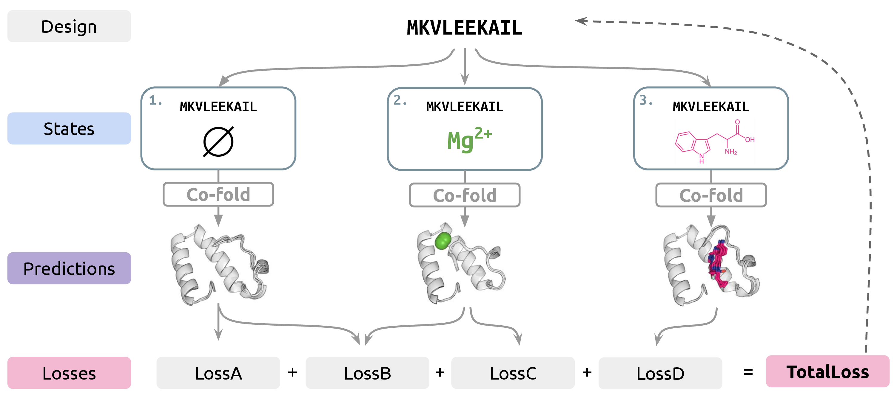

# SwitchCraft

Implementation of [**SwitchCraft: A Programmatic Framework for Desigining State Switching Protein**](https://arxiv.org/abs/2605.31236) (ICML 2026) by Bowen Jing*, Mihir Bafna*, Anisha Parsan, Heyuan Michael Ni, David Kwabi-Addo, Bryan Bryson, Adam Klivans, Bonnie Berger.

SwitchCraft is a framework for designing state-switching proteins via gradient-based optimization through AF3-style co-folding models (here, Boltz-1). Given a multistate design objective, SwitchCraft constructs and optimizes a compositional loss function to design a sequence that exhibits the desired multistate behavior. Please see our preprint for detailed methodology and benchmarks. 

> [!NOTE]
> This repository is provided for _in silico_ research reproducibility. It does not yet provide an end-to-end design workflow with _in vitro_ experimental validation.



---

## Installation

**1. Clone the repository**
```bash
git clone https://github.com/bjing2016/switchcraft
cd switchcraft
```

**2. Install PyTorch with CUDA support**

Install a PyTorch version matching your CUDA driver. For CUDA 12.x:
```bash
pip install "torch==2.7.1+cu126" --index-url https://download.pytorch.org/whl/cu126
```

**3. Install Boltz and remaining dependencies**
```bash
pip install -e boltz/
pip install prody
```

**4. Download Boltz model weights and CCD ligand database**

```bash
python -c "
from boltz.main import download
from pathlib import Path
cache = Path('boltz')
cache.mkdir(parents=True, exist_ok=True)
download(cache)
"
```

**5. Install LigandMPNN and model weights** (only needed if using `--ligandmpnn_seqs`)
```bash
cd LigandMPNN && bash get_model_params.sh ./model_params && cd ..
```

---

## Singularity / Apptainer container

For GPU clusters, a pre-built environment is provided under `containers/switchcraft.def`. The image installs SwitchCraft, Boltz, cuEquivariance, **Boltz weights** (`boltz/boltz1_conf.ckpt`, `boltz/ccd.pkl`), and **LigandMPNN weights** at build time, so routine runs do not need extra weight bind-mounts.

### Build the image

From the repository root (Linux; build requires network access):

```bash
apptainer build switchcraft.sif containers/switchcraft.def
# or: singularity build switchcraft.sif containers/switchcraft.def
```

Build-time `%test` may print `libcuda.so.1` warnings and `cuda available False` without a GPU; that is expected. Use `--nv` at **runtime** on a GPU node.

### Minimal interactive run

On a GPU node, only the **output directory** on the host needs to be bound. Use config paths relative to `/opt/switchcraft` (same as the Quick Start examples under `tasks/`):

```bash
mkdir -p /scratch/${USER}/switchcraft_out

apptainer exec --nv --pwd /opt/switchcraft \
  -B /scratch/${USER}/switchcraft_out:/scratch/${USER}/switchcraft_out \
  switchcraft.sif \
  python switchcraft.py \
    --config tasks/pos_allostery.yaml \
    --outpath /scratch/${USER}/switchcraft_out \
    --verbose
```

Built-in configs (`tasks/pos_allostery.yaml`, etc.) and `motifs/` are already in the image; you do not need to copy them unless you are customizing a design.

**Custom YAML on the host:** bind the file into the image and pass its path under `/opt/switchcraft`, e.g. `-B /scratch/${USER}/my_design.yaml:/opt/switchcraft/my_design.yaml` and `--config my_design.yaml` (still use `--pwd /opt/switchcraft`).

### SLURM

`slurm_scripts/launch_switchcraft.slurm` wraps the same invocation. Replace the `#SBATCH` placeholders (`<partition>`, `<gpus_per_node>`, etc.) for your site, then submit:

```bash
mkdir -p /scratch/${USER}/switchcraft_out

sbatch slurm_scripts/launch_switchcraft.slurm \
  tasks/pos_allostery.yaml \
  /path/to/switchcraft.sif \
  /scratch/${USER}/switchcraft_out
```

| Argument | Meaning |
|----------|---------|
| `CONFIG_FILE` | YAML path inside the image (e.g. `tasks/pos_allostery.yaml`) |
| `SWITCHCRAFT_IMAGE` | Path to `switchcraft.sif` |
| `OUTPUT_DIR` | Host directory for results (bind-mounted) |

**Interactive test** (e.g. inside `salloc` on a GPU node, no `sbatch`):

```bash
bash slurm_scripts/launch_switchcraft.slurm \
  tasks/pos_allostery.yaml \
  /path/to/switchcraft.sif \
  /scratch/${USER}/switchcraft_out
```

---

## Quick Start

Each design run is driven by a YAML config file that fully specifies the design problem. Template configs for example tasks live in `tasks/`.

Example command:

```bash
python switchcraft.py --config tasks/pos_allostery.yaml 
```

This runs the `pos_allostery` task: design a protein that scaffolds motif `1prw` in the ligand-bound state and loses the motif geometry when the ligand unbinds.

**Output** for each design is saved to `<outpath>/<motif>/design<N>/`:
- `state<i>_sample<j>.pdb` — predicted structures (5 diffusion samples per state)
- `state<i>_sample<j>.cif` — same structures in mmCIF format
- `state<i>.pkl` — raw model output (pLDDT, pTM, pAE, etc.)
- `<motif>_spec.pkl` — motif specification used for evaluation

Command line arguments that can be provided include
- `--length`: override scaffold length (required if no motifs and not set in config)
- `--recycles`: Boltz recycling steps during optimization
- `--ligandmpnn_seqs`: if >0, run LigandMPNN redesign producing N sequences per design
- `--verbose`: whether to use progress bars (recommended)
- `-o` / `--outpath`: output directory (README shorthand: output dir)
- `--num_designs`: total number of designs

---

## Design Configs

Each multistate design problem is specified as a YAML file which provides (1) a list of states, each defined as a list of ligands, and (2) a list of loss functions with appropriate arguments. Template configs for built-in tasks described in our paper are in `tasks/`. Copy a template (or create a new one), fill in your motifs and ligands, and pass it to `--config`.

### Schema

```yaml
num_states: 2          # number of structural states

motifs:                # PDB stems under motifs/ (determines scaffold length)
  - 1prw

states:                # list of states; each state is a list of ligand strings
  - []                 # state 0: apo — no ligands
  - ["ccd:<CODE>"]     # state 1: holo — one CCD ligand
  # ligand string formats:
  #   "ccd:<CODE>"        small molecule by CCD code
  #   "ligand:<SMILES>"   small molecule by SMILES
  #   "protein:<SEQ>"     protein chain
  #   "dna:<SEQ>"         DNA (both strands added automatically)
  #   "rna:<SEQ>"         RNA

losses:
  - type: MotifLoss        # loss class name (see Loss Types below)
    motif: 0               # index into motifs list (MotifLoss/AntiMotifLoss only)
    state: 0               # state index (int) or pair of states (list) for ConfChangeLoss
    weight: 1.0            # optional loss weight (default 1.0)
    strength: 1.0          # optional strength parameter (loss-specific)

# contact_loss: true     # set false to disable automatic ContactLoss on all states
# length: 100            # explicit scaffold length (overrides motif-derived length)
```

### Loss Types

Losses are specified in `losses.py` and can be easily extended.

| Loss | Description | Parameters |
|---|---|---|
| `MotifLoss` | Enforce motif geometry | `motif` (index) |
| `AntiMotifLoss` | Penalize motif geometry | `motif` (index) |
| `LigandContactLoss` | Promote protein–ligand contacts | `strength`, `idx` |
| `AntiLigandContactLoss` | Penalize protein–ligand contacts | `strength`, `idx` |
| `ConfChangeLoss` | Maximize conformational difference between two states | `strength`; `state` must be a 2-element list |
| `HelixBiasLoss` | Bias toward (strength > 0) or away from helices | `strength` |
| `SheetBiasLoss` | Bias toward (strength > 0) or away from sheets | `strength` |
| `RadiusOfGyrationLoss` | Penalize over-extended conformations | `strength` |
| `SequenceSimilarityLoss` | Push sequence toward a target | `target_sequence`, `strength` |

A `ContactLoss` (to promote well-structured backbones) is added automatically to every state unless `contact_loss: false` is set.

### Built-in Tasks

| Config | States | Description |
|---|---|---|
| `tasks/neg_allostery.yaml` | 2 | **Negative allostery**: motif active when apo, disrupted when ligand binds |
| `tasks/pos_allostery.yaml` | 2 | **Positive allostery**: motif absent when apo, formed when ligand binds |
| `tasks/induced_binding.yaml` | 2 | Binds one ligand only in the presence of a second effector ligand |
| `tasks/ligand_discrimination.yaml` | 3 | Adopts different conformations depending on which of two ligands are bound |
| `tasks/motif_switching.yaml` | 2 | Motif 1 active when apo, motif 2 active when holo |

---

## Evaluation

Analysis scripts used in the paper are in `./analysis`.

---

## License

MIT. Separate licenses may apply to third-party source code.

## Acknowledgement

This repository is adapted from or based on https://github.com/yehlincho/BoltzDesign1, https://github.com/jwohlwend/boltz, and https://github.com/dauparas/LigandMPNN. Big thanks to the developers of these open-source projects!

